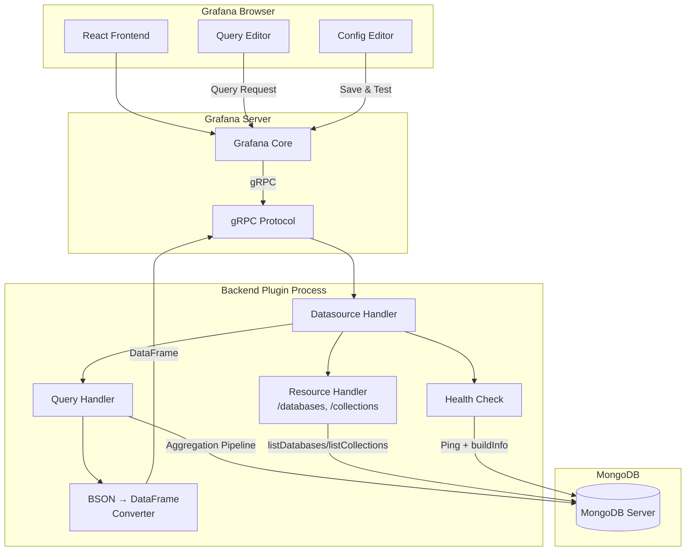

# Development Guide

This guide covers the development setup, project architecture, and build process for the MongoDB datasource plugin.

## Prerequisites

| Tool | Version | Purpose |
|------|---------|---------|
| [Node.js](https://nodejs.org/) | >= 22 | Runtime and package manager (npm) |
| [Go](https://go.dev/) | >= 1.23 | Backend plugin development |
| [Mage](https://magefile.org/) | Latest | Go build targets |
| [Docker](https://www.docker.com/) | Latest | Development environment |

> **Important**: This project uses **npm** as the package manager. Do not use yarn, pnpm, or bun.

## Quick Setup

```bash
# Clone the repository
git clone https://github.com/milosmiric/mongodb-datasource.git
cd mongodb-datasource

# Install frontend dependencies
npm install

# Build and start everything
make build
make up

# Open Grafana
open http://localhost:3105
```

## Ports

The development environment uses non-standard ports to avoid conflicts:

| Service | Port | Default |
|---------|------|---------|
| Grafana | **3105** | 3000 |
| MongoDB | **27105** | 27017 |
| Delve (Go debugger) | **2345** | 2345 |

## Project Structure

```
mongodb-datasource/
├── .config/                    # Build tooling configuration
│   ├── jest.config.js          # Jest test configuration
│   ├── jest-setup.js           # Test environment setup (polyfills)
│   └── webpack/
│       └── webpack.config.ts   # Webpack build configuration
├── .github/workflows/          # CI/CD pipelines
│   ├── ci.yml                  # Lint, test, build, E2E
│   └── release.yml             # Build, sign, publish release
├── docker/
│   └── mongo-seed/
│       └── seed.js             # Sample data for development
├── docs/                       # Detailed documentation
├── pkg/                        # Go backend
│   ├── main.go                 # Plugin entry point
│   └── plugin/
│       ├── datasource.go       # MongoClient interface, Datasource struct, HTTP handlers
│       ├── query.go            # Pipeline parsing, variable interpolation, query execution
│       ├── models.go           # QueryModel, DatasourceSettings, parsing
│       ├── converters.go       # BSON → Grafana DataFrame conversion
│       ├── errors.go           # Sentinel errors
│       ├── doc.go              # Package documentation
│       ├── *_test.go           # Unit tests (alongside source files)
│       └── testdata/           # JSON test fixtures
├── provisioning/               # Grafana provisioning (auto-loaded in Docker)
│   ├── datasources/
│   │   └── mongodb.yml         # Pre-configured MongoDB datasource
│   └── dashboards/
│       ├── dashboard.yml       # Dashboard provider config
│       └── mongodb-sample.json # Sample dashboard with macros, $__match, multi-select
├── src/                        # React/TypeScript frontend
│   ├── module.ts               # Plugin entry point
│   ├── datasource.ts           # DataSourceWithBackend extension
│   ├── types.ts                # Shared TypeScript interfaces
│   ├── plugin.json             # Plugin metadata
│   ├── img/logo.svg            # Plugin icon
│   ├── components/
│   │   ├── ConfigEditor/       # Datasource settings form
│   │   └── QueryEditor/        # Query editor with sub-components
│   ├── hooks/                  # Data fetching hooks
│   └── testdata/               # Jest test mocks
├── tests/                      # Playwright E2E tests
├── docker-compose.yml          # Development environment
├── Magefile.go                 # Go build targets
├── package.json                # Frontend dependencies and scripts
├── go.mod / go.sum             # Go dependencies
└── tsconfig.json               # TypeScript configuration
```

## Architecture



### Key Design Patterns

**Dependency Injection**: The `MongoClient` interface wraps the MongoDB driver, enabling test doubles without a real database:

```go
type MongoClient interface {
    Ping(ctx context.Context) error
    ListDatabaseNames(ctx context.Context) ([]string, error)
    ListCollectionNames(ctx context.Context, database string) ([]string, error)
    Aggregate(ctx context.Context, database, collection string, pipeline interface{}) ([]bson.D, error)
    ServerVersion(ctx context.Context) (string, error)
    ReplicaSetStatus(ctx context.Context) (string, error)
    Disconnect(ctx context.Context) error
}
```

**Connection Pooling**: One `*mongo.Client` per datasource instance, managed by Grafana's `instancemgmt.InstanceManager`. Connections are automatically disposed when datasource settings change.

**Context Propagation**: All query and connection methods accept `context.Context` for cancellation support (e.g., when a user navigates away from a dashboard).

## Make Targets

All common development tasks are available as `make` targets. Run `make help` to see the full list with descriptions.

### Build

| Target | Description |
|--------|-------------|
| `make build` | Build both frontend and backend |
| `make build-frontend` | Build the React frontend (production) |
| `make build-backend` | Build the Go backend for the current platform |
| `make build-backend-debug` | Build the Go backend with debug symbols |
| `make build-backend-all` | Cross-compile the Go backend for all platforms |
| `make dev` | Start frontend in watch mode (auto-rebuild on changes) |

### Test

| Target | Description |
|--------|-------------|
| `make test` | Run all tests (Go + Jest) |
| `make test-backend` | Run Go unit tests with race detector |
| `make test-backend-cover` | Run Go tests with coverage report |
| `make test-frontend` | Run Jest frontend unit tests |
| `make test-frontend-cover` | Run Jest tests with coverage |
| `make e2e` | Run Playwright E2E tests (requires Docker running) |
| `make e2e-ui` | Run Playwright E2E tests with interactive UI |
| `make e2e-install` | Install Playwright browsers |

### Lint & Check

| Target | Description |
|--------|-------------|
| `make lint` | Run all linters (ESLint + golangci-lint) |
| `make lint-frontend` | Run ESLint on frontend code |
| `make lint-fix` | Run ESLint with auto-fix |
| `make lint-backend` | Run golangci-lint on Go code |
| `make typecheck` | Run TypeScript type checking |
| `make check` | Run all linters, type checks, and tests |

### Docker / Dev Environment

| Target | Description |
|--------|-------------|
| `make up` | Start the development environment (Grafana + MongoDB) |
| `make down` | Stop the development environment |
| `make restart` | Restart all containers |
| `make restart-grafana` | Restart only Grafana (picks up new backend binary) |
| `make logs` | Tail logs from all containers |
| `make logs-grafana` | Tail Grafana logs only |
| `make logs-mongo` | Tail MongoDB logs only |

### Database

| Target | Description |
|--------|-------------|
| `make db-seed` | Seed MongoDB with fresh demo data (drops existing collections) |
| `make db-reseed` | Re-seed by running the seed container |
| `make db-reset` | Drop the demo database entirely, then re-seed |
| `make db-shell` | Open an interactive MongoDB shell |
| `make db-stats` | Show collection stats for the demo database |
| `make db-random` | Generate and insert 500 random sensor readings (last hour) |

### Plugin Lifecycle

| Target | Description |
|--------|-------------|
| `make rebuild` | Rebuild everything and restart Grafana |
| `make health` | Check Grafana and datasource health |
| `make clean` | Remove build artifacts |
| `make clean-all` | Remove build artifacts + Docker volumes |
| `make fresh` | Full clean rebuild: wipe everything, build, start fresh |

## Development Workflow

### Frontend Development (Watch Mode)

```bash
make dev
```

This starts webpack in watch mode. Changes to TypeScript/React files will rebuild automatically. Refresh the Grafana browser tab to see changes.

### Backend Development

After modifying Go files:

```bash
make rebuild    # Rebuilds frontend + backend, restarts Grafana
```

Or if you only changed Go code:

```bash
make build-backend && make restart-grafana
```

### Debugging the Go Backend

Build with debug symbols and attach Delve:

```bash
# Build debug binary
make build-backend-debug

# In another terminal, attach debugger
dlv attach $(pgrep gpx_mongodb) --headless --listen=:2345 --api-version=2
```

Then connect your IDE's debugger to `localhost:2345`.

## Testing

### Go Unit Tests

```bash
make test-backend
```

All tests use the mock `MongoClient` interface — no real MongoDB connection needed.

Test coverage areas:
- `converters_test.go` — Every BSON type conversion (ObjectID, Decimal128, Date, Boolean, Int32, Int64, Double, String, Array, embedded doc, null, sparse documents)
- `query_test.go` — Pipeline parsing, variable interpolation (15+ variables), macro expansion (`$__timeFilter`, `$__timeGroup`, `$__oidFilter`, `$__timeFilter_ms`), `$__match` stage processing, interval decomposition, query execution with mock client, error cases
- `models_test.go` — JSON unmarshalling, validation, settings parsing
- `datasource_test.go` — Health check, dispose lifecycle, multi-query handling

### Frontend Unit Tests

```bash
npm run test             # Watch mode (interactive)
make test-frontend       # CI mode (single run)
```

Test coverage areas:
- `ConfigEditor.test.tsx` — Renders fields, onChange callbacks, conditional TLS/auth sections
- `QueryEditor.test.tsx` — Renders sub-components, format toggle, time field visibility
- `PipelineEditor.test.ts` — `formatPipeline` function: macro argument handling, template variable preservation, dotted fields, `$__match` stage keys, invalid JSON fallback

### E2E Tests (Playwright)

Requires Docker Compose running:

```bash
make up                  # Start environment
make e2e-install         # Install Chromium (first time only)
make e2e                 # Run tests
make e2e-ui              # Interactive UI mode
```

E2E test scenarios:
- Health check — Save & test, verify success message
- Config editor — Navigate to settings, verify fields
- Query editor — Create panel, verify editor components, format toggle
- Query execution — Table and time series queries, aggregation pipelines, error/empty states
- Macros — `$__timeFilter`, `$__timeGroup`, `$__timeFilter_ms`, `$__oidFilter` end-to-end
- Dashboards — Sample dashboard loads, all panels render data, no errors
- Template variables — Single-select, multi-select, and "All" variable interactions

### Type Checking and Linting

```bash
make typecheck           # TypeScript strict checks
make lint                # All linters (ESLint + golangci-lint)
make lint-fix            # ESLint with auto-fix
make check               # Everything: lint + typecheck + test
```

## Build for Production

### Frontend

```bash
make build-frontend
```

Output goes to `dist/` including `module.js`, `plugin.json`, and static assets.

### Backend (All Platforms)

```bash
make build-backend-all
```

This cross-compiles for linux/amd64, linux/arm64, darwin/amd64, darwin/arm64, and windows/amd64.

## Docker Compose Environment

The development environment includes:

| Service | Image | Purpose |
|---------|-------|---------|
| `grafana` | grafana/grafana-oss:latest | Grafana with plugin mounted from `./dist` |
| `mongodb` | mongo:8 | MongoDB 8 single-node replica set |
| `mongo-seed` | mongo:8 | Init container that loads sample data |

### Sample Data

The seed script (`docker/mongo-seed/seed.js`) creates a `demo` database with:

| Collection | Documents | Description |
|------------|-----------|-------------|
| `sensors` | 1,000 | Time-series sensor readings (temperature, humidity, pressure, wind) |
| `users` | 5 | User profiles with various field types |
| `events` | 200 | Application events with nested metadata |
| `orders` | ~5,000 | 180 days of order data (category, region, status, amount) |
| `types_showcase` | 2 | Documents exercising all BSON types |

### Reset the Environment

```bash
make fresh                # Full wipe: clean artifacts, remove volumes, rebuild, restart
```

Or step by step:

```bash
make clean-all            # Remove build artifacts + Docker volumes
make build                # Rebuild frontend + backend
make up                   # Start fresh with re-seeded data
```

## CI/CD

### CI Pipeline (`.github/workflows/ci.yml`)

Runs on every push to `main` and all pull requests:

| Job | What it does |
|-----|-------------|
| lint-frontend | ESLint + TypeScript type checking |
| test-frontend | Jest with coverage report |
| lint-backend | golangci-lint |
| test-backend | Go tests with race detector and coverage |
| build-frontend | Webpack production build |
| build-backend | Cross-compile for 5 platforms |
| e2e | Docker Compose + Playwright |

### Release Pipeline (`.github/workflows/release.yml`)

Triggered by pushing a version tag (`v*`):

1. Builds frontend and all backend binaries
2. Signs the plugin (requires `GRAFANA_ACCESS_POLICY_TOKEN` secret)
3. Packages as zip with checksums
4. Creates a GitHub Release with changelog excerpt
